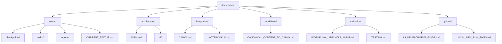

# Documentation Structure Plan

## Rationale
To improve navigability and maintainability, all documents must be classified into clear functional categories. No files (except this index) may remain in the root.

## Final Folder Layout

## Migration Map

### 1. Architecture (`architecture/`)
*   `ARCHITECTURAL_FIX_001_SSE.md`
*   `ARCHITECTURE_DECISIONS.md`
*   `ARCHITECTURE_QUICK_REFERENCE.md`
*   `ARCHITECTURE_VALIDATION.md`
*   `POSTGRES_FALLBACK_SOLUTION.md`
*   `UI_ARCHITECTURE.md`
*   `UI_UX_SPEC_T24.md`
*   `DATABASE_SCHEMA.md` (from docs/)

### 2. Validation & Testing (`validation/`)
*   `E2E_TESTING_GUIDE.md`
*   `E2E_TESTING_REPORT.md`
*   `STEP2_VALIDATION_RUNBOOK.md`
*   `TESTING.md`
*   `TEST_EXECUTION_T26.md`
*   `TEST_INVENTORY.md`
*   `TEST_README.md`
*   `TROUBLESHOOTING_T28.md`
*   `ACCEPTANCE_EVIDENCE_PHASE1.md` (from docs/)
*   `VALIDATION_SSE_RECONNECT.md` (if not already moved)

### 3. Guides & Instructions (`guides/`)
*   `LOCAL_DEV_RUN_FIXES.md`
*   `UI_DEMO.md`
*   `UI_DEVELOPMENT_GUIDE.md`
*   `UI_VISUAL_TOUR.md`
*   `ALEMBIC_GUIDE.md` (from docs/)
*   `SETUP.md` (from docs/)

### 4. Status - Reports (`status/reports/`)
*   `STEP1_ANALYSIS.md`
*   `STEP2_ARCHITECTURE.md`
*   `STEP2_VALIDATION_INDEX.md`
*   `STEP3_DEVELOPMENT_PLAN.md`
*   `SESSION_SUMMARY.md`
*   `PHASE_1_T1_SUMMARY.md` (from docs/)

### 5. Status - Tasks (`status/tasks/`)
*   `T*_*.md` (All T-prefix files)
*   `TASK_PREFIX_*.md` (Task A, Task B files)
*   `REPOSITORY_HYGIENE_CLEANUP.md`

### 6. Status - Checkpoints (`status/checkpoints/`)
*   `CHECKPOINT_*.md` (All checkpoints)

### 7. Status - General (`status/`)
*   `ANTIGRAVITY_INIT.md`
*   `CURRENT_STATUS.md`
*   `PRODUCTIZATION_PLAN.md`
*   `PRODUCTIZATION_PROGRESS.md`
*   `QUICK_REF_STEP2.md`
*   `README_STEPS_1-3.md`
*   `UI_COMPLETION_CHECKLIST.md`
*   `UI_MIGRATION_SUMMARY.md`

### 8. Integration (`integration/`)
*   `CANVA.md`
*   `NOTEBOOKLM.md`

### 9. Workflows (`workflows/`)
*   `CANONICAL_CONTENT_TO_CANVA.md`
