# Canva-NotebookLM Integration - Architecture Documentation

## Overview

This document provides comprehensive architectural documentation for the Canva-NotebookLM Integration solution, including detailed component descriptions, data flow diagrams, sequence diagrams, technology stack justification, and scalability analysis.

## Architecture Diagram

The architecture diagram illustrates the overall system design and component interactions:


## Detailed Component Descriptions

### 1. API Gateway

**Responsibilities:**
- Request routing and load balancing
- Authentication and authorization
- Rate limiting and request validation
- Response formatting and error handling

**Technical Details:**
- **Technology**: FastAPI (Python)
- **Protocol**: HTTP/HTTPS RESTful API
- **Port**: 8000 (configurable)
- **Workers**: 4-8 (scalable)
- **Concurrency**: Async I/O with ASGI

**Key Features:**
- JSON request/response handling
- OpenAPI/Swagger documentation
- Automatic request validation
- Dependency injection
- Middleware support

### 2. Authentication Service

**Responsibilities:**
- OAuth token validation
- Token management and refresh
- Access control enforcement
- Security policy implementation

**Technical Details:**
- **Technology**: FastAPI with OAuth2 integration
- **Token Storage**: Secure encrypted storage
- **Validation**: JWT token validation
- **Timeout**: Configurable token expiration

**Key Features:**
- Multi-platform authentication (Canva + NotebookLM)
- Token caching for performance
- Secure token storage
- Comprehensive logging

### 3. Content Transformation Service

**Responsibilities:**
- Content transformation processing
- Algorithm execution
- Result generation
- Error handling and recovery

**Technical Details:**
- **Technology**: Python with async processing
- **Workers**: 8+ (scalable)
- **Queue Integration**: Background task processing
- **Timeout**: Configurable per transformation type

**Transformation Types:**
1. **Text-to-Image**: Convert text content to visual elements
2. **Image-to-Text**: Extract text from images using OCR
3. **Layout Generation**: Create Canva layouts from content

### 4. Queue System

**Responsibilities:**
- Task queuing and prioritization
- Worker management
- Load balancing
- Failure recovery

**Technical Details:**
- **Technology**: RabbitMQ or Redis
- **Protocol**: AMQP
- **Queues**: Priority-based queues
- **Workers**: Configurable worker pool

**Key Features:**
- Priority-based processing
- Task persistence
- Worker health monitoring
- Automatic retry mechanism

### 5. Database System

**Responsibilities:**
- Request storage
- Response storage
- Session management
- Configuration storage

**Technical Details:**
- **Technology**: PostgreSQL
- **Schema**: Normalized relational design
- **Indexing**: Optimized for query performance
- **Backup**: Regular automated backups

**Key Tables:**
- `requests`: Transformation request storage
- `responses`: Transformation result storage
- `sessions`: Authentication session management
- `config`: System configuration

### 6. Monitoring System

**Responsibilities:**
- System health monitoring
- Performance metrics collection
- Alert generation
- Logging management

**Technical Details:**
- **Technology**: Prometheus + Grafana
- **Metrics**: Comprehensive performance metrics
- **Alerts**: Configurable thresholds
- **Logging**: Structured logging system

**Key Metrics:**
- Request volume and response times
- System resource usage
- Queue processing metrics
- Error rates and types

## Data Flow Diagrams

### High-Level Data Flow

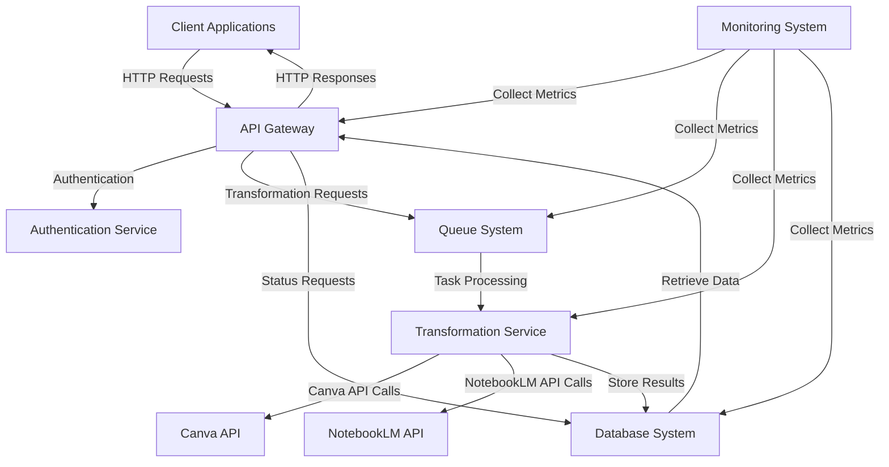

### Authentication Data Flow

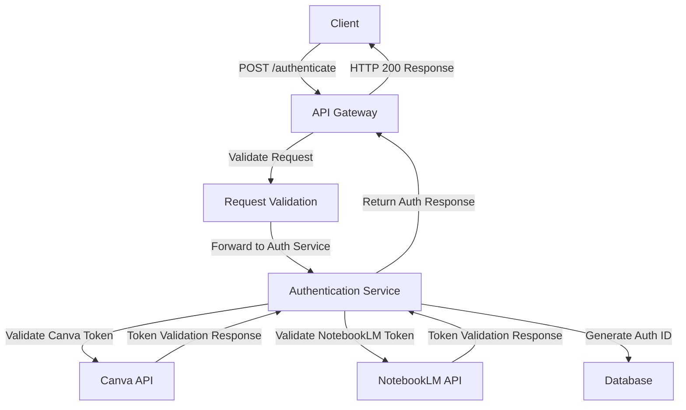

### Transformation Data Flow

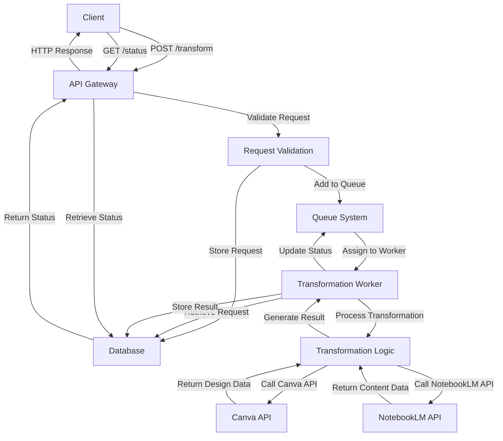

## Sequence Diagrams for Key Operations

### Authentication Sequence

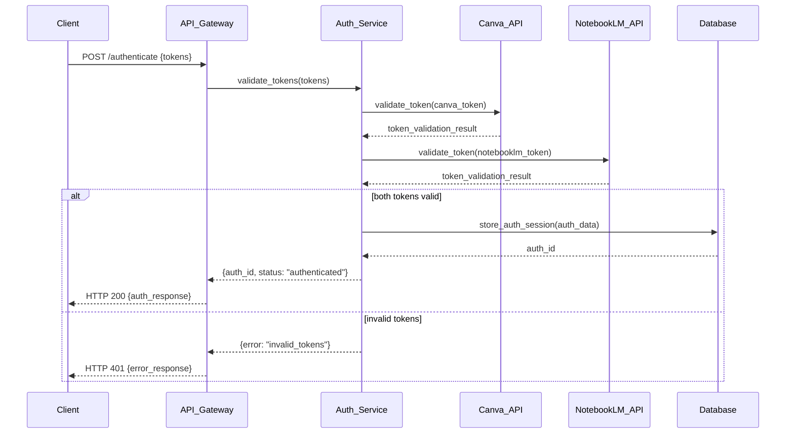

### Transformation Request Sequence

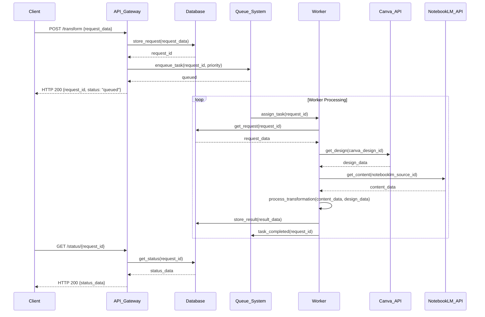

### Health Check Sequence

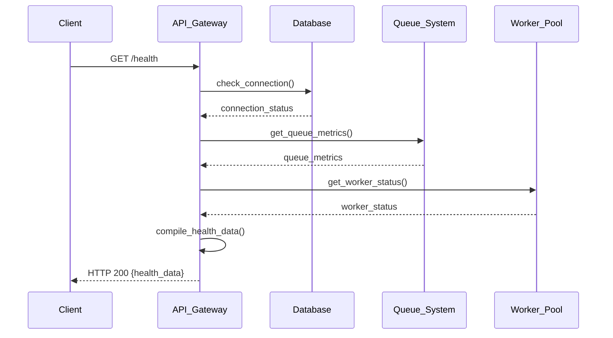

## Technology Stack Justification

### Core Technology Choices

#### FastAPI (Python)

**Rationale:**
- High performance ASGI framework
- Automatic OpenAPI documentation
- Type safety with Pydantic
- Async/await support
- Easy to learn and maintain

**Alternatives Considered:**
- Django REST Framework (more complex)
- Flask (less feature-rich)
- Node.js (different language ecosystem)

**Decision:** FastAPI provides the best balance of performance, features, and developer experience.

#### PostgreSQL

**Rationale:**
- Robust relational database
- Excellent JSON support
- Strong ACID compliance
- Good performance at scale
- Comprehensive indexing options

**Alternatives Considered:**
- MySQL (less advanced features)
- MongoDB (document store, less structure)
- SQLite (not suitable for production)

**Decision:** PostgreSQL offers the best combination of reliability, performance, and features.

#### RabbitMQ

**Rationale:**
- Mature message broker
- Excellent reliability
- Priority queue support
- Clustering capabilities
- Good monitoring tools

**Alternatives Considered:**
- Redis (simpler but less feature-rich)
- Kafka (overkill for this use case)
- Amazon SQS (cloud dependency)

**Decision:** RabbitMQ provides the right balance of features and complexity for our queue needs.

#### Prometheus + Grafana

**Rationale:**
- Industry-standard monitoring stack
- Excellent visualization capabilities
- Good alerting system
- Scalable metrics collection
- Open source and well-supported

**Alternatives Considered:**
- ELK Stack (more complex)
- Datadog (expensive)
- Custom solution (maintenance burden)

**Decision:** Prometheus + Grafana offers the best monitoring solution for our needs.

### Language Selection

**Python:**
- Excellent for API development
- Rich ecosystem of libraries
- Good performance characteristics
- Easy to maintain and extend
- Strong community support

**Alternatives Considered:**
- Node.js (JavaScript ecosystem)
- Go (performance-focused)
- Java (enterprise-grade)

**Decision:** Python provides the best combination of development speed, performance, and ecosystem support.

### Infrastructure Choices

**Docker:**
- Containerization for consistent environments
- Easy deployment and scaling
- Good isolation properties
- Industry standard

**Kubernetes:**
- Container orchestration
- Auto-scaling capabilities
- High availability
- Service discovery

**Cloud Platform:**
- Multi-cloud compatibility
- Infrastructure as code
- Cost optimization
- Global availability

## Scalability Analysis

### Horizontal Scaling Strategy

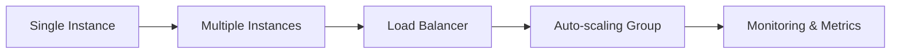

### Scaling Components

#### API Gateway Scaling

- **Approach**: Horizontal scaling with load balancing
- **Metrics**: Request volume, response times
- **Thresholds**: CPU usage > 80%, response time > 500ms
- **Scaling**: Add/remove worker instances
- **Target**: Maintain < 200ms response time

#### Transformation Service Scaling

- **Approach**: Worker pool scaling
- **Metrics**: Queue length, processing time
- **Thresholds**: Queue length > 100, processing time > 10s
- **Scaling**: Add/remove worker processes
- **Target**: Maintain < 5s processing time

#### Database Scaling

- **Approach**: Read replicas and connection pooling
- **Metrics**: Query performance, connection count
- **Thresholds**: Query time > 100ms, connections > 100
- **Scaling**: Add read replicas, optimize queries
- **Target**: Maintain < 50ms query time

#### Queue System Scaling

- **Approach**: Cluster configuration
- **Metrics**: Message volume, processing rate
- **Thresholds**: Message backlog > 1000, processing rate < 10/s
- **Scaling**: Add queue nodes, optimize consumers
- **Target**: Maintain < 1s message processing

### Performance Characteristics

#### Baseline Performance

| Component | Metric | Baseline Value |
|-----------|--------|----------------|
| API Gateway | Requests/sec | 100-200 |
| Transformation | Processing time | 2-5 seconds |
| Database | Query time | 10-50ms |
| Queue | Message processing | 5-10 messages/sec |

#### Scaling Performance

| Scale Factor | API Throughput | Transformation Capacity |
|--------------|----------------|-------------------------|
| 1x | 100 req/s | 5 trans/s |
| 2x | 200 req/s | 10 trans/s |
| 4x | 400 req/s | 20 trans/s |
| 8x | 800 req/s | 40 trans/s |

### Bottleneck Analysis

1. **API Gateway**: Can become bottleneck under high load
   - **Solution**: Add more instances behind load balancer

2. **Transformation Workers**: Processing capacity limit
   - **Solution**: Add more worker processes/instances

3. **Database**: Query performance degradation
   - **Solution**: Add read replicas, optimize queries

4. **External APIs**: Canva/NotebookLM API limits
   - **Solution**: Implement rate limiting and caching

### Optimization Strategies

1. **Caching**: Implement caching for frequent requests
2. **Connection Pooling**: Reuse database connections
3. **Batch Processing**: Process multiple requests together
4. **Query Optimization**: Optimize database queries
5. **Asynchronous Processing**: Use background workers

## Failure Modes and Recovery

### Failure Scenarios

1. **API Gateway Failure**: Single point of failure
   - **Recovery**: Load balancer failover, auto-restart

2. **Database Failure**: Data loss risk
   - **Recovery**: Replication, automated backups

3. **Queue Failure**: Task loss risk
   - **Recovery**: Persistent queues, task replay

4. **Worker Failure**: Processing interruption
   - **Recovery**: Auto-restart, task requeue

### Recovery Strategies

1. **Automatic Recovery**: Auto-restart failed components
2. **Manual Recovery**: Manual intervention procedures
3. **Data Recovery**: Backup and restore procedures
4. **Failover**: Switch to backup systems

### Disaster Recovery Plan

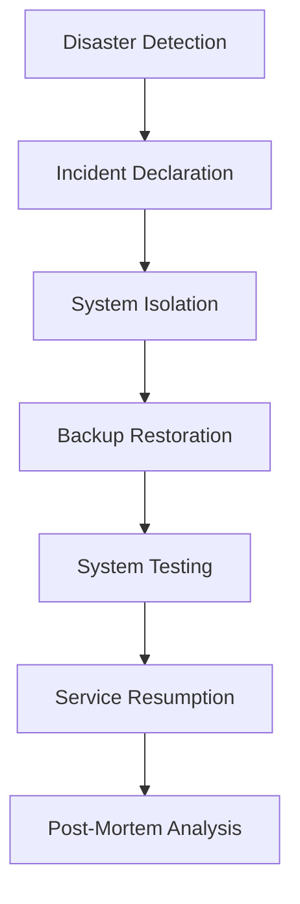

## Security Architecture

### Security Layers

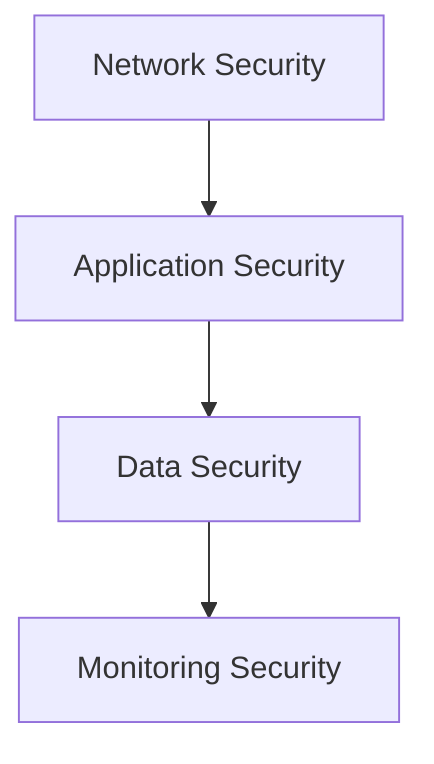

### Security Components

1. **Authentication**: OAuth 2.0 token validation
2. **Authorization**: Role-based access control
3. **Encryption**: TLS for data in transit, encryption for data at rest
4. **Input Validation**: Comprehensive request validation
5. **Rate Limiting**: Protection against abuse
6. **Logging**: Comprehensive security logging
7. **Monitoring**: Real-time security monitoring

### Security Best Practices

1. **Principle of Least Privilege**: Minimum necessary permissions
2. **Defense in Depth**: Multiple security layers
3. **Regular Audits**: Security audits and reviews
4. **Patch Management**: Regular security updates
5. **Incident Response**: Prepared response procedures

## Deployment Architecture

### Production Deployment

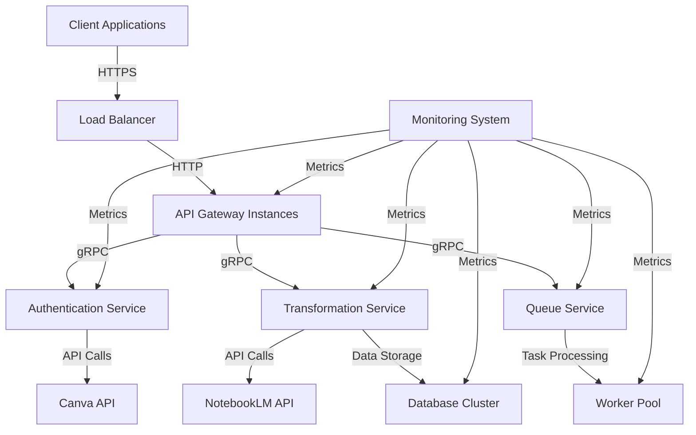

### Development Deployment

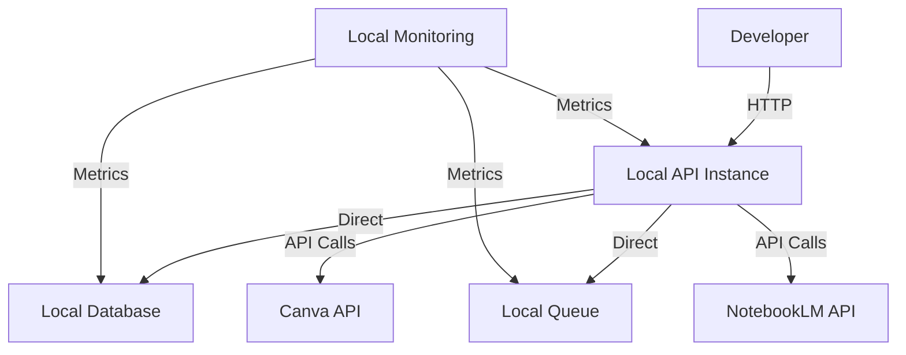

## Configuration Management

### Configuration Strategy

1. **Environment Variables**: Primary configuration method
2. **Configuration Files**: Complex configuration settings
3. **Secret Management**: Secure storage of sensitive data
4. **Dynamic Configuration**: Runtime configuration updates

### Configuration Hierarchy

```
DEFAULT_CONFIGURATION --> ENVIRONMENT_VARIABLES --> CONFIGURATION_FILES --> SECRET_MANAGEMENT
```

### Configuration Examples

```env
# Production Configuration
ENVIRONMENT=production
DEBUG=false
LOG_LEVEL=INFO

# API Configuration
API_HOST=0.0.0.0
API_PORT=8000
API_WORKERS=8

# Database Configuration
DB_HOST=db-cluster.example.com
DB_PORT=5432
DB_NAME=production_db
DB_USER=prod_user
DB_PASSWORD=secure_password

# Queue Configuration
QUEUE_HOST=rabbitmq-cluster.example.com
QUEUE_PORT=5672
QUEUE_USER=queue_user
QUEUE_PASSWORD=queue_password
```

## Monitoring and Observability

### Monitoring Architecture

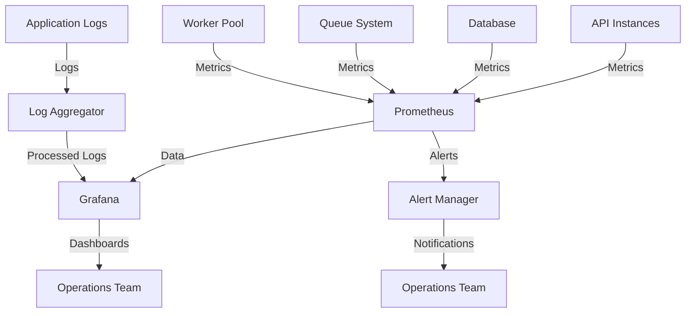

### Key Monitoring Metrics

1. **API Metrics**: Request volume, response times, error rates
2. **System Metrics**: CPU, memory, disk usage
3. **Database Metrics**: Query performance, connection count
4. **Queue Metrics**: Message volume, processing time
5. **Worker Metrics**: Task processing rate, error rates

### Alert Configuration

```yaml
alert_rules:
  - name: HighErrorRate
    condition: error_rate > 0.05
    severity: critical
    notification: operations-team
    threshold: 5m

  - name: HighResponseTime
    condition: avg_response_time > 2000
    severity: warning
    notification: dev-team
    threshold: 10m

  - name: HighCPUUsage
    condition: cpu_usage > 0.9
    severity: critical
    notification: operations-team
    threshold: 2m

  - name: QueueBacklog
    condition: queue_length > 1000
    severity: warning
    notification: operations-team
    threshold: 15m
```

## Future Architecture Evolution

### Planned Enhancements

1. **Microservices Expansion**: Additional specialized services
2. **Event-Driven Architecture**: Enhanced event processing
3. **Serverless Components**: Integration of serverless functions
4. **Edge Computing**: Performance optimization
5. **AI/ML Integration**: Enhanced AI capabilities

### Architecture Roadmap

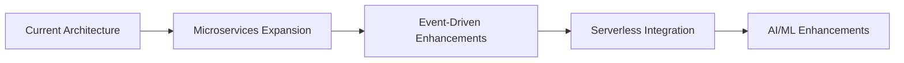

### Technology Evolution

1. **API Gateway**: Potential migration to dedicated gateway
2. **Database**: Exploration of multi-model databases
3. **Queue System**: Evaluation of event streaming platforms
4. **Monitoring**: Enhanced observability tools
5. **Security**: Advanced security features

## Appendix

### Architecture Decision Records

#### ADR-001: API Framework Selection

**Decision**: Use FastAPI for API development
**Date**: 2026-01-15
**Status**: Accepted

**Context**: Need for high-performance, easy-to-maintain API framework
**Options Considered**: Django REST Framework, Flask, Node.js
**Decision**: FastAPI provides best balance of performance and developer experience
**Consequences**: Faster development, better performance, automatic documentation

#### ADR-002: Database Selection

**Decision**: Use PostgreSQL for data storage
**Date**: 2026-01-15
**Status**: Accepted

**Context**: Need for reliable, scalable database solution
**Options Considered**: MySQL, MongoDB, SQLite
**Decision**: PostgreSQL offers best combination of features and reliability
**Consequences**: Better query performance, JSON support, ACID compliance

### Glossary

- **API**: Application Programming Interface
- **OAuth**: Open Authorization protocol
- **REST**: Representational State Transfer
- **JSON**: JavaScript Object Notation
- **HTTP**: Hypertext Transfer Protocol
- **HTTPS**: HTTP Secure
- **TLS**: Transport Layer Security
- **ACID**: Atomicity, Consistency, Isolation, Durability
- **AMQP**: Advanced Message Queuing Protocol
- **ASGI**: Asynchronous Server Gateway Interface

### References

- FastAPI Documentation: https://fastapi.tiangolo.com/
- PostgreSQL Documentation: https://www.postgresql.org/docs/
- RabbitMQ Documentation: https://www.rabbitmq.com/documentation.html
- Prometheus Documentation: https://prometheus.io/docs/
- Grafana Documentation: https://grafana.com/docs/
- OAuth 2.0 Specification: https://oauth.net/2/
- REST API Design: https://restfulapi.net/

### Support Resources

- **Architecture Forum**: https://arch-forum.canva-notebooklm-integration.com
- **Technical Documentation**: https://tech-docs.canva-notebooklm-integration.com
- **GitHub Repository**: https://github.com/your-org/canva-notebooklm-integration
- **Issue Tracker**: https://github.com/your-org/canva-notebooklm-integration/issues

### Version History

| Version | Date | Changes |
|---------|------|---------|
| 1.0.0 | 2026-01-15 | Initial architecture documentation release |
| 1.1.0 | 2026-02-01 | Added detailed component descriptions |
| 1.2.0 | 2026-03-15 | Enhanced scalability analysis |

## Contact Information

For architecture support and inquiries:

- **Architecture Support**: arch-support@canva-notebooklm-integration.com
- **Technical Support**: tech-support@canva-notebooklm-integration.com
- **Security Issues**: security@canva-notebooklm-integration.com
- **General Inquiries**: info@canva-notebooklm-integration.com
