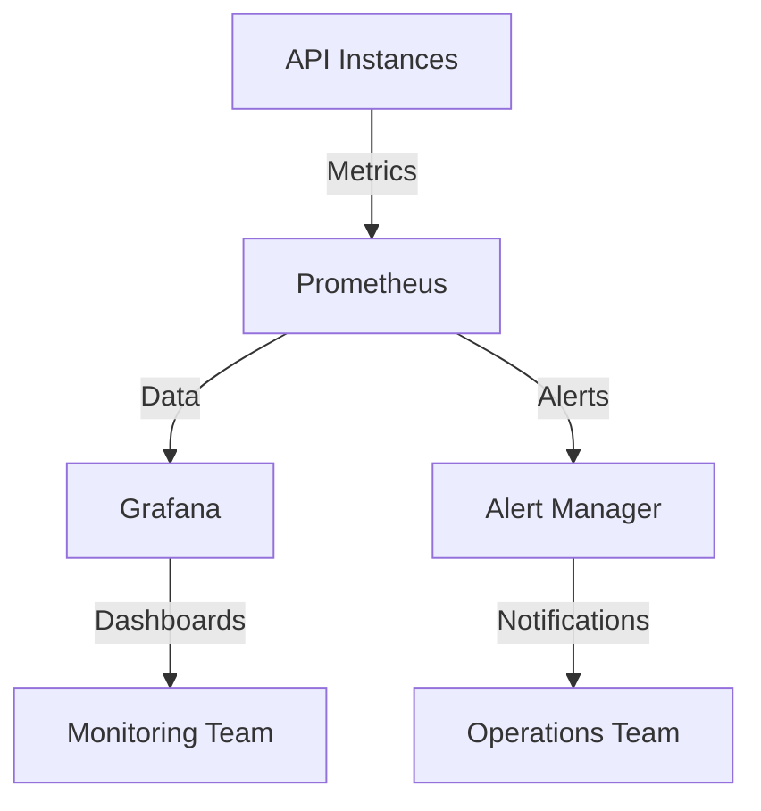

# Canva-NotebookLM Integration - Implementation Guide

## Deployment Overview

This guide provides comprehensive instructions for deploying the Canva-NotebookLM Integration solution in production environments.

## Prerequisites

### System Requirements

- **Operating System**: Linux (Ubuntu 20.04/22.04 or CentOS 7/8 recommended)
- **CPU**: 4+ cores (8+ cores recommended for production)
- **Memory**: 8GB+ RAM (16GB+ recommended for production)
- **Storage**: 50GB+ SSD storage
- **Network**: Stable internet connection with API access

### Software Requirements

- **Container Runtime**: Docker 20.10+ or Podman 3.0+
- **Container Orchestration**: Kubernetes 1.20+ (for production) or Docker Compose (for development)
- **Python**: Python 3.8+ (for local development)
- **Database**: PostgreSQL 12+ or MySQL 8.0+
- **Message Queue**: RabbitMQ 3.8+ or Redis 6.0+

### Network Requirements

- **Ports**: 8000 (API), 5432 (Database), 5672 (RabbitMQ), 6379 (Redis)
- **External Access**: HTTPS access to Canva API and NotebookLM API
- **Firewall**: Configure firewall to allow necessary traffic

## Step-by-Step Deployment Instructions

### 1. Environment Preparation

#### System Setup

```bash
# Update system packages
sudo apt-get update && sudo apt-get upgrade -y

# Install required dependencies
sudo apt-get install -y     curl     wget     git     build-essential     python3     python3-pip     python3-venv

# Install Docker
curl -fsSL https://get.docker.com | sudo sh
sudo usermod -aG docker $USER
newgrp docker

# Install Docker Compose
sudo curl -L "https://github.com/docker/compose/releases/download/v2.2.3/docker-compose-$(uname -s)-$(uname -m)" -o /usr/local/bin/docker-compose
sudo chmod +x /usr/local/bin/docker-compose
```

#### Python Environment Setup

```bash
# Create Python virtual environment
python3 -m venv venv
source venv/bin/activate

# Install Python dependencies
pip install --upgrade pip
pip install -r requirements.txt
```

### 2. Configuration Setup

#### Environment Configuration

Create a `.env` file in the project root directory:

```bash
cp .env.example .env
```

Edit the `.env` file with appropriate values:

```env
# API Configuration
API_HOST=0.0.0.0
API_PORT=8000
API_WORKERS=4

# Authentication Configuration
AUTH_TIMEOUT=300
AUTH_RETRY_LIMIT=3

# Transformation Configuration
TRANSFORMATION_TIMEOUT=600
TRANSFORMATION_RETRY_LIMIT=2
TRANSFORMATION_WORKERS=8

# Database Configuration
DB_HOST=db
DB_PORT=5432
DB_NAME=integration_db
DB_USER=integration_user
DB_PASSWORD=your_secure_password

# External API Configuration
CANVA_API_BASE_URL=https://api.canva.com/v1
NOTEBOOKLM_API_BASE_URL=https://api.notebooklm.com/v1

# Queue Configuration
QUEUE_HOST=rabbitmq
QUEUE_PORT=5672
QUEUE_USER=queue_user
QUEUE_PASSWORD=queue_password
```

#### Database Setup

```bash
# Create database and user (PostgreSQL example)
sudo -u postgres psql -c "CREATE DATABASE integration_db;"
sudo -u postgres psql -c "CREATE USER integration_user WITH PASSWORD 'your_secure_password';"
sudo -u postgres psql -c "GRANT ALL PRIVILEGES ON DATABASE integration_db TO integration_user;"
```

### 3. Deployment Options

#### Option A: Docker Compose Deployment (Development/Testing)

```bash
# Create docker-compose.yml file
docker-compose.yml:

version: '3.8'

services:
  api:
    build: .
    ports:
      - "8000:8000"
    environment:
      - API_HOST=0.0.0.0
      - API_PORT=8000
    depends_on:
      - db
      - rabbitmq
    restart: unless-stopped

  db:
    image: postgres:13
    environment:
      - POSTGRES_DB=integration_db
      - POSTGRES_USER=integration_user
      - POSTGRES_PASSWORD=your_secure_password
    volumes:
      - postgres_data:/var/lib/postgresql/data
    ports:
      - "5432:5432"
    restart: unless-stopped

  rabbitmq:
    image: rabbitmq:3.8-management
    environment:
      - RABBITMQ_DEFAULT_USER=queue_user
      - RABBITMQ_DEFAULT_PASS=queue_password
    ports:
      - "5672:5672"
      - "15672:15672"
    volumes:
      - rabbitmq_data:/var/lib/rabbitmq
    restart: unless-stopped

volumes:
  postgres_data:
  rabbitmq_data:

# Start the services
docker-compose up -d --build
```

#### Option B: Kubernetes Deployment (Production)

```bash
# Create Kubernetes deployment files

# deployment.yaml
apiVersion: apps/v1
kind: Deployment
metadata:
  name: canva-notebooklm-api
spec:
  replicas: 3
  selector:
    matchLabels:
      app: canva-notebooklm-api
  template:
    metadata:
      labels:
        app: canva-notebooklm-api
    spec:
      containers:
      - name: api
        image: your-registry/canva-notebooklm-api:latest
        ports:
        - containerPort: 8000
        envFrom:
        - configMapRef:
            name: api-config
        - secretRef:
            name: api-secrets
        resources:
          requests:
            cpu: "500m"
            memory: "512Mi"
          limits:
            cpu: "1000m"
            memory: "1024Mi"

# service.yaml
apiVersion: v1
kind: Service
metadata:
  name: canva-notebooklm-api
spec:
  selector:
    app: canva-notebooklm-api
  ports:
    - protocol: TCP
      port: 80
      targetPort: 8000
  type: LoadBalancer

# Apply Kubernetes configuration
kubectl apply -f deployment.yaml
kubectl apply -f service.yaml
```

### 4. Service Configuration

#### API Configuration

```bash
# Configure API settings
cat > config/api_config.json << EOF
{
  "max_request_size": "10MB",
  "max_concurrent_requests": 100,
  "rate_limit": {
    "requests_per_minute": 1000,
    "burst_limit": 200
  },
  "cors": {
    "allowed_origins": ["*"],
    "allowed_methods": ["GET", "POST", "PUT", "DELETE"],
    "allowed_headers": ["*"]
  }
}
EOF
```

#### Transformation Configuration

```bash
# Configure transformation settings
cat > config/transformation_config.json << EOF
{
  "text_to_image": {
    "max_text_length": 5000,
    "default_image_size": "1024x1024",
    "quality_level": "high"
  },
  "image_to_text": {
    "max_image_size": "5MB",
    "supported_formats": ["jpg", "png", "gif"],
    "ocr_quality": "high"
  },
  "layout_generation": {
    "default_templates": ["presentation", "social_media", "document"],
    "max_elements": 50,
    "default_style": "modern"
  }
}
EOF
```

### 5. Security Configuration

#### SSL/TLS Configuration

```bash
# Generate SSL certificates (or use existing ones)
sudo apt-get install -y certbot
sudo certbot certonly --standalone -d your-domain.com

# Configure API to use SSL
cat > config/ssl_config.json << EOF
{
  "ssl_cert": "/etc/letsencrypt/live/your-domain.com/fullchain.pem",
  "ssl_key": "/etc/letsencrypt/live/your-domain.com/privkey.pem",
  "ssl_port": 443,
  "http_to_https_redirect": true
}
EOF
```

#### Authentication Configuration

```bash
# Configure OAuth settings
cat > config/auth_config.json << EOF
{
  "canva_oauth": {
    "client_id": "your_canva_client_id",
    "client_secret": "your_canva_client_secret",
    "redirect_uri": "https://your-domain.com/canva/callback",
    "scope": ["design:read", "design:write", "content:read"]
  },
  "notebooklm_oauth": {
    "client_id": "your_notebooklm_client_id",
    "client_secret": "your_notebooklm_client_secret",
    "redirect_uri": "https://your-domain.com/notebooklm/callback",
    "scope": ["content:read", "content:write", "analysis:read"]
  }
}
EOF
```

### 6. Monitoring Setup

#### Prometheus Configuration

```bash
# Install Prometheus
wget https://github.com/prometheus/prometheus/releases/download/v2.30.3/prometheus-2.30.3.linux-amd64.tar.gz
tar xvfz prometheus-*.tar.gz
cd prometheus-*

# Create Prometheus configuration
cat > prometheus.yml << EOF
global:
  scrape_interval: 15s
  evaluation_interval: 15s

scrape_configs:
  - job_name: 'canva-notebooklm-api'
    static_configs:
      - targets: ['localhost:8000']
EOF

# Start Prometheus
./prometheus --config.file=prometheus.yml
```

#### Grafana Configuration

```bash
# Install Grafana
wget https://dl.grafana.com/oss/release/grafana-8.1.2.linux-amd64.tar.gz
tar -zxf grafana-*.tar.gz
cd grafana-*

# Start Grafana
./bin/grafana-server web

# Access Grafana at http://localhost:3000
# Configure data source to point to Prometheus
```

### 7. Logging Configuration

```bash
# Configure logging
cat > config/logging_config.json << EOF
{
  "log_level": "INFO",
  "log_file": "/var/log/canva-notebooklm/api.log",
  "max_file_size": "100MB",
  "backup_count": 5,
  "log_format": "%(asctime)s - %(name)s - %(levelname)s - %(message)s",
  "error_log_file": "/var/log/canva-notebooklm/errors.log",
  "access_log_file": "/var/log/canva-notebooklm/access.log"
}
EOF

# Set up log rotation
cat > /etc/logrotate.d/canva-notebooklm << EOF
/var/log/canva-notebooklm/*.log {
    daily
    missingok
    rotate 7
    compress
    delaycompress
    notifempty
    create 0640 root root
    sharedscripts
    postrotate
        systemctl reload canva-notebooklm-api
    endscript
}
EOF
```

### 8. Service Startup

```bash
# Start the service

# For Docker Compose
cd /path/to/project
docker-compose up -d

# For Kubernetes
kubectl apply -f kubernetes/

# For local development
source venv/bin/activate
uvicorn main:app --host 0.0.0.0 --port 8000 --workers 4
```

## Configuration Requirements

### Minimum Configuration

- **Workers**: 2 API workers
- **Database**: Single instance with 2GB RAM
- **Queue**: Single RabbitMQ instance
- **Storage**: 50GB SSD

### Recommended Configuration

- **Workers**: 4-8 API workers (scalable)
- **Database**: High-availability cluster with 8GB+ RAM
- **Queue**: RabbitMQ cluster with 4GB+ RAM
- **Storage**: 100GB+ SSD with backup

### High-Availability Configuration

- **Workers**: 8+ API workers across multiple nodes
- **Database**: Multi-region database cluster
- **Queue**: Distributed RabbitMQ cluster
- **Storage**: Distributed storage with replication
- **Load Balancing**: Multiple load balancers with failover

## Scaling Recommendations

### Horizontal Scaling

```
SINGLE_INSTANCE → MULTIPLE_INSTANCES → LOAD_BALANCER → AUTO_SCALING_GROUP
```

#### Scaling Strategy

1. **Monitor Load**: Track request volume and response times
2. **Set Thresholds**: Define scaling thresholds (e.g., 80% CPU usage)
3. **Add Instances**: Scale out by adding more worker instances
4. **Load Balancing**: Distribute traffic across instances
5. **Auto-scaling**: Implement automatic scaling based on metrics

#### Scaling Configuration

```yaml
# Auto-scaling configuration example
auto_scaling:
  min_instances: 2
  max_instances: 10
  scale_up_threshold: 0.8  # CPU usage
  scale_down_threshold: 0.3  # CPU usage
  cooldown_period: 300  # seconds
```

### Vertical Scaling

```
SMALL_INSTANCE → MEDIUM_INSTANCE → LARGE_INSTANCE → CUSTOM_INSTANCE
```

#### Vertical Scaling Recommendations

1. **CPU**: Scale CPU based on computation requirements
2. **Memory**: Scale memory based on data processing needs
3. **Storage**: Scale storage based on data volume
4. **Network**: Scale network bandwidth based on traffic

### Performance Optimization

```
PERFORMANCE_MONITORING → BOTTLENECK_IDENTIFICATION → OPTIMIZATION_IMPLEMENTATION → PERFORMANCE_VALIDATION
```

#### Optimization Techniques

1. **Caching**: Implement caching for frequently accessed data
2. **Connection Pooling**: Reuse database and API connections
3. **Query Optimization**: Optimize database queries
4. **Batch Processing**: Process requests in batches
5. **Asynchronous Processing**: Use background workers

## Monitoring Setup

### Monitoring Architecture



### Monitoring Components

1. **Prometheus**: Metrics collection and storage
2. **Grafana**: Visualization and dashboards
3. **Alert Manager**: Alerting and notifications
4. **Logging System**: Log collection and analysis

### Monitoring Configuration

```bash
# Install monitoring stack

# Prometheus configuration
cat > prometheus_config.yml << EOF
global:
  scrape_interval: 15s
  evaluation_interval: 15s

scrape_configs:
  - job_name: 'api'
    static_configs:
      - targets: ['api:8000']
  - job_name: 'database'
    static_configs:
      - targets: ['db:9187']
  - job_name: 'queue'
    static_configs:
      - targets: ['rabbitmq:15692']
EOF

# Grafana datasource configuration
cat > grafana_datasource.json << EOF
{
  "name": "Prometheus",
  "type": "prometheus",
  "url": "http://prometheus:9090",
  "access": "proxy",
  "basicAuth": false
}
EOF
```

### Key Metrics to Monitor

1. **API Metrics**: Request volume, response times, error rates
2. **System Metrics**: CPU usage, memory usage, disk I/O
3. **Database Metrics**: Query performance, connection count
4. **Queue Metrics**: Message volume, processing time
5. **Authentication Metrics**: Auth success/failure rates

### Alert Configuration

```yaml
# Alert rules example
alert_rules:
  - name: HighErrorRate
    condition: error_rate > 0.05
    severity: critical
    notification: operations-team
    threshold: 5m

  - name: HighResponseTime
    condition: avg_response_time > 2000
    severity: warning
    notification: dev-team
    threshold: 10m

  - name: HighCPUUsage
    condition: cpu_usage > 0.9
    severity: critical
    notification: operations-team
    threshold: 2m
```

## Maintenance Procedures

### Regular Maintenance Tasks

1. **Daily Tasks**:
   - Check system health and logs
   - Monitor queue processing
   - Verify database connections

2. **Weekly Tasks**:
   - Review performance metrics
   - Check for failed requests
   - Update monitoring dashboards

3. **Monthly Tasks**:
   - Review system configuration
   - Update dependencies
   - Test backup procedures

### Backup Procedures

```bash
# Database backup
docker exec db pg_dump -U integration_user integration_db > backup_$(date +%Y%m%d).sql

# Configuration backup
tar -czvf config_backup_$(date +%Y%m%d).tar.gz config/

# Full system backup
docker-compose down
tar -czvf full_backup_$(date +%Y%m%d).tar.gz .
docker-compose up -d
```

### Update Procedures

```bash
# Update procedure

# 1. Backup current system
docker-compose down
tar -czvf backup_before_update.tar.gz .

# 2. Update code
git pull origin main

# 3. Update dependencies
pip install --upgrade -r requirements.txt

# 4. Rebuild containers
docker-compose build

# 5. Run tests
docker-compose run api pytest

# 6. Deploy update
docker-compose up -d

# 7. Monitor system
watch -n 5 curl -s http://localhost:8000/health
```

### Troubleshooting Guide

#### Common Issues and Solutions

1. **Authentication Failures**:
   - Check token validity and expiration
   - Verify API credentials
   - Test external API connectivity

2. **Transformation Errors**:
   - Validate input content format
   - Check transformation type support
   - Review error logs for details

3. **Performance Issues**:
   - Check system resource usage
   - Review queue processing times
   - Analyze database query performance

4. **Connection Issues**:
   - Verify network connectivity
   - Check firewall settings
   - Test external API availability

#### Debugging Tools

```bash
# Check API health
curl http://localhost:8000/health

# Check request status
curl http://localhost:8000/status/REQUEST_ID

# Check logs
tail -f /var/log/canva-notebooklm/api.log

# Check database
docker exec -it db psql -U integration_user integration_db

# Check queue
docker exec -it rabbitmq rabbitmqctl list_queues
```

### Disaster Recovery

```
DISASTER_DETECTION → INCIDENT_DECLARATION → BACKUP_RESTORATION → SYSTEM_RECOVERY → SERVICE_RESUMPTION
```

#### Recovery Procedures

1. **Identify Issue**: Determine scope and impact
2. **Declare Incident**: Notify stakeholders
3. **Restore Backup**: Use most recent backup
4. **Test System**: Verify functionality
5. **Resume Service**: Bring system online
6. **Post-Mortem**: Analyze cause and prevent recurrence

## Deployment Checklist

### Pre-Deployment Checklist

- [ ] System requirements verified
- [ ] Dependencies installed
- [ ] Configuration files created
- [ ] Environment variables set
- [ ] Database configured
- [ ] Queue system configured
- [ ] SSL certificates configured
- [ ] Monitoring configured
- [ ] Logging configured
- [ ] Backup procedures tested

### Deployment Checklist

- [ ] System backed up
- [ ] Maintenance window announced
- [ ] Deployment script executed
- [ ] System health verified
- [ ] Basic functionality tested
- [ ] Monitoring verified
- [ ] Logging verified
- [ ] Performance metrics checked

### Post-Deployment Checklist

- [ ] Full functionality tested
- [ ] Integration testing completed
- [ ] Performance testing completed
- [ ] Security testing completed
- [ ] Monitoring alerts tested
- [ ] Backup procedures verified
- [ ] Documentation updated
- [ ] Stakeholders notified

## Security Best Practices

### Deployment Security

1. **Secure Configuration**: Use secure default configurations
2. **Secret Management**: Use proper secret management
3. **Access Control**: Implement least privilege access
4. **Network Security**: Configure proper network security
5. **Monitoring**: Implement comprehensive monitoring

### Operational Security

1. **Regular Updates**: Keep system updated
2. **Security Patching**: Apply security patches promptly
3. **Access Reviews**: Regular access reviews
4. **Security Testing**: Regular security testing
5. **Incident Response**: Implement incident response procedures

## Performance Tuning

### Performance Optimization Guide

1. **Identify Bottlenecks**: Use profiling tools
2. **Optimize Queries**: Improve database queries
3. **Implement Caching**: Add caching where appropriate
4. **Tune Configuration**: Adjust system configuration
5. **Scale Resources**: Add resources as needed

### Performance Testing

```bash
# Load testing example
locust -f load_test.py --host=http://localhost:8000

# Benchmark testing
ab -n 1000 -c 100 http://localhost:8000/health
```

## Appendix

### Configuration Templates

#### Docker Compose Template

```yaml
docker-compose-template.yml:

version: '3.8'

services:
  api:
    build: .
    ports:
      - "8000:8000"
    environment:
      - API_HOST=0.0.0.0
      - API_PORT=8000
      - API_WORKERS=4
    depends_on:
      - db
      - rabbitmq
    restart: unless-stopped

  db:
    image: postgres:13
    environment:
      - POSTGRES_DB=integration_db
      - POSTGRES_USER=integration_user
      - POSTGRES_PASSWORD=your_secure_password
    volumes:
      - postgres_data:/var/lib/postgresql/data
    ports:
      - "5432:5432"
    restart: unless-stopped

  rabbitmq:
    image: rabbitmq:3.8-management
    environment:
      - RABBITMQ_DEFAULT_USER=queue_user
      - RABBITMQ_DEFAULT_PASS=queue_password
    ports:
      - "5672:5672"
      - "15672:15672"
    volumes:
      - rabbitmq_data:/var/lib/rabbitmq
    restart: unless-stopped

volumes:
  postgres_data:
  rabbitmq_data:
```

### Troubleshooting Reference

#### Error Code Reference

| Error Code | Description | Solution |
|------------|-------------|----------|
| AUTH_001 | Invalid authentication token | Verify token and retry |
| TRANS_001 | Invalid transformation type | Check transformation type |
| TRANS_002 | Content too large | Reduce content size |
| API_001 | External API unavailable | Check API status and retry |
| DB_001 | Database connection failed | Check database configuration |

### Support Resources

- **Documentation**: https://docs.canva-notebooklm-integration.com
- **API Reference**: https://api-docs.canva-notebooklm-integration.com
- **Community Forum**: https://community.canva-notebooklm-integration.com
- **Support Portal**: https://support.canva-notebooklm-integration.com
- **Issue Tracker**: https://issues.canva-notebooklm-integration.com

### Version History

| Version | Date | Changes |
|---------|------|---------|
| 1.0.0 | 2026-01-15 | Initial release |
| 1.1.0 | 2026-02-01 | Added scaling recommendations |
| 1.2.0 | 2026-03-15 | Enhanced monitoring setup |

## Contact Information

For deployment support and inquiries:

- **Deployment Support**: deployment@canva-notebooklm-integration.com
- **Technical Support**: support@canva-notebooklm-integration.com
- **Security Issues**: security@canva-notebooklm-integration.com
- **General Inquiries**: info@canva-notebooklm-integration.com
