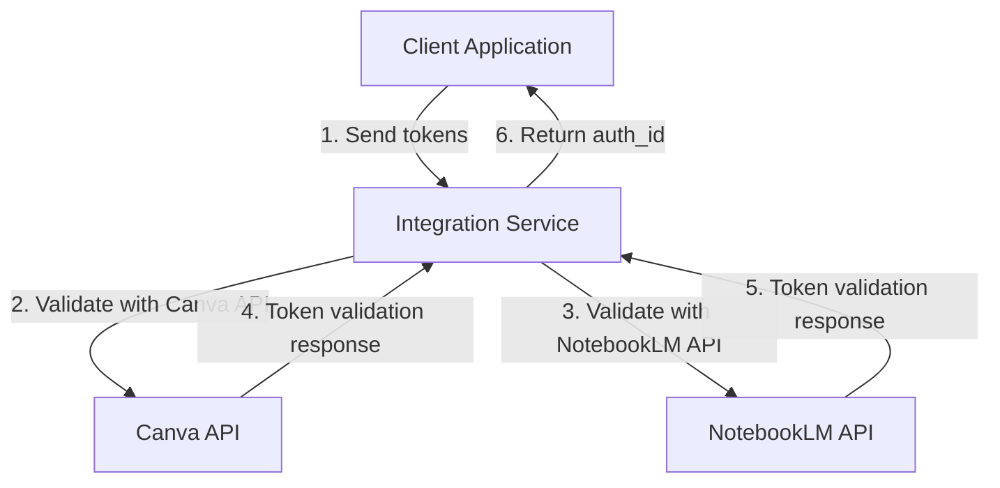
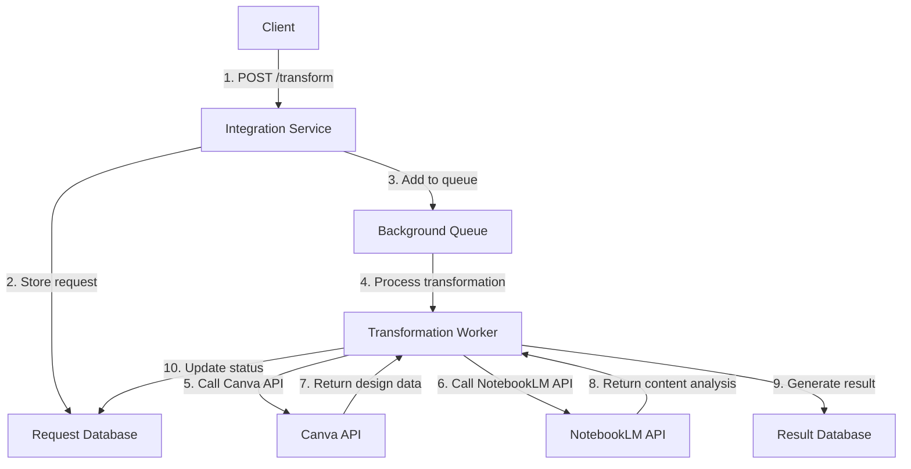
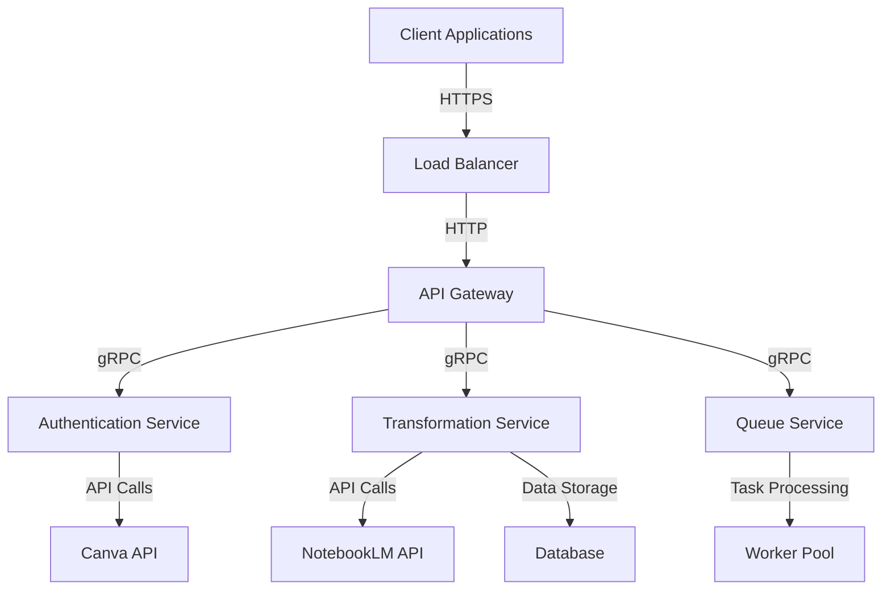

# Canva-NotebookLM Integration - Technical Documentation

## API Integration Details

### Authentication API

The authentication service handles OAuth integration with both Canva and NotebookLM platforms.

#### Authentication Endpoint

```
POST /authenticate
```

**Request Body:**
```json
{
  "canva_auth_token": "your_canva_oauth_token",
  "notebooklm_auth_token": "your_notebooklm_oauth_token"
}
```

**Response:**
```json
{
  "auth_id": "unique_authentication_id",
  "status": "authenticated",
  "message": "Successfully authenticated with both platforms"
}
```

### Content Transformation API

The core transformation service handles content processing between platforms.

#### Transformation Request Endpoint

```
POST /transform
```

**Request Body:**
```json
{
  "canva_design_id": "design_identifier",
  "notebooklm_source_id": "source_identifier",
  "transformation_type": "text_to_image|image_to_text|layout_generation",
  "content_data": {
    // Transformation-specific content
  },
  "priority": 1
}
```

**Response:**
```json
{
  "request_id": "unique_request_identifier",
  "status": "queued",
  "message": "Transformation request added to queue"
}
```

### Status Monitoring API

```
GET /status/{request_id}
```

**Response:**
```json
{
  "request_id": "request_identifier",
  "status": "queued|processing|completed|failed",
  "request_details": {
    // Original request information
  },
  "response_details": {
    // Transformation results or error information
  }
}
```

### Health Check API

```
GET /health
```

**Response:**
```json
{
  "status": "healthy",
  "timestamp": "2026-01-15T16:06:11Z",
  "active_requests": 5,
  "completed_requests": 42
}
```

## Authentication Flow Diagrams

### OAuth Authentication Flow



### Transformation Request Flow



## Content Transformation Algorithms

### Text-to-Image Transformation

1. **Input Processing**: Extract text content from NotebookLM source
2. **Content Analysis**: Analyze text for visual representation suitability
3. **Image Generation**: Create visual elements based on text content
4. **Canva Integration**: Insert generated images into Canva design
5. **Layout Optimization**: Position and size elements appropriately

**Algorithm Flow:**
```
TEXT_CONTENT → CONTENT_ANALYSIS → IMAGE_GENERATION → CANVA_INTEGRATION → LAYOUT_OPTIMIZATION
```

### Image-to-Text Transformation

1. **Image Analysis**: Extract visual content from Canva design
2. **OCR Processing**: Convert image text to machine-readable format
3. **Content Extraction**: Identify key textual elements
4. **NotebookLM Integration**: Store extracted content in NotebookLM
5. **Metadata Generation**: Create content analysis and summaries

**Algorithm Flow:**
```
IMAGE_CONTENT → OCR_PROCESSING → CONTENT_EXTRACTION → NOTEBOOKLM_INTEGRATION → METADATA_GENERATION
```

### Automatic Layout Generation

1. **Content Analysis**: Analyze source content structure and semantics
2. **Design Pattern Selection**: Choose appropriate layout templates
3. **Element Positioning**: Calculate optimal element placement
4. **Style Application**: Apply consistent styling rules
5. **Canva Design Creation**: Generate complete Canva design

**Algorithm Flow:**
```
SOURCE_CONTENT → CONTENT_ANALYSIS → DESIGN_SELECTION → ELEMENT_POSITIONING → STYLE_APPLICATION → DESIGN_CREATION
```

## Error Handling Strategies

### Error Classification

1. **Authentication Errors**: Invalid or expired tokens
2. **API Connection Errors**: Network or service availability issues
3. **Content Processing Errors**: Invalid content formats or sizes
4. **Transformation Errors**: Algorithm-specific processing failures
5. **Database Errors**: Data storage or retrieval issues

### Error Handling Approach

```
1. ERROR_DETECTION → 2. ERROR_CLASSIFICATION → 3. ERROR_LOGGING → 4. ERROR_RECOVERY → 5. CLIENT_NOTIFICATION
```

### Specific Error Handling Strategies

1. **Authentication Errors**:
   - Validate tokens before processing
   - Implement token refresh mechanism
   - Provide clear error messages to clients

2. **API Connection Errors**:
   - Implement retry logic with exponential backoff
   - Set appropriate timeout values
   - Provide fallback mechanisms where possible

3. **Content Processing Errors**:
   - Validate content formats and sizes
   - Implement content normalization
   - Provide detailed error information

4. **Transformation Errors**:
   - Implement algorithm-specific error recovery
   - Provide fallback transformation methods
   - Log detailed error information for debugging

### Error Response Format

```json
{
  "request_id": "request_identifier",
  "status": "failed",
  "error_type": "authentication|api_connection|content_processing|transformation|database",
  "error_message": "Detailed error description",
  "error_details": {
    "timestamp": "error_timestamp",
    "context": "additional_context_information"
  },
  "recovery_suggestions": ["suggestion_1", "suggestion_2"]
}
```

## Performance Considerations

### Performance Optimization Strategies

1. **Caching**: Implement caching for frequently accessed data
2. **Batch Processing**: Process multiple requests in batches where possible
3. **Asynchronous Processing**: Use background workers for long-running tasks
4. **Connection Pooling**: Reuse API connections to reduce overhead
5. **Load Balancing**: Distribute requests across multiple workers

### Performance Metrics

1. **Request Processing Time**: Time from request to completion
2. **Queue Processing Time**: Time spent in processing queue
3. **API Response Time**: Time for external API calls
4. **System Throughput**: Requests processed per time unit
5. **Error Rate**: Percentage of failed requests

### Scaling Recommendations

1. **Horizontal Scaling**: Add more worker instances for increased load
2. **Vertical Scaling**: Increase resources for individual workers
3. **Auto-scaling**: Implement automatic scaling based on load metrics
4. **Resource Allocation**: Optimize resource allocation based on usage patterns

### Performance Monitoring

```
METRIC_COLLECTION → DATA_AGGREGATION → THRESHOLD_ANALYSIS → ALERT_GENERATION → PERFORMANCE_OPTIMIZATION
```

## Security Considerations

### Authentication Security

1. **Token Validation**: Validate all authentication tokens
2. **Token Storage**: Securely store tokens with encryption
3. **Token Expiration**: Implement token expiration and refresh
4. **Access Control**: Implement proper access control mechanisms

### Data Security

1. **Data Encryption**: Encrypt sensitive data at rest and in transit
2. **Data Validation**: Validate all input and output data
3. **Data Sanitization**: Sanitize data to prevent injection attacks
4. **Data Isolation**: Isolate data between different clients

### API Security

1. **Rate Limiting**: Implement rate limiting to prevent abuse
2. **Request Validation**: Validate all API requests
3. **Response Filtering**: Filter sensitive information from responses
4. **Security Headers**: Implement proper security headers

## Deployment Architecture

### Containerized Deployment

```
Docker Container → Kubernetes Cluster → Load Balancer → API Gateway → Service Mesh → Microservices
```

### Deployment Requirements

1. **Container Runtime**: Docker or similar container runtime
2. **Orchestration**: Kubernetes or similar orchestration platform
3. **Networking**: Proper network configuration for API access
4. **Storage**: Persistent storage for request and response data
5. **Monitoring**: Monitoring and logging infrastructure

### Deployment Topology



## Configuration Management

### Environment Configuration

```env
# API Configuration
API_HOST=0.0.0.0
API_PORT=8000
API_WORKERS=4

# Authentication Configuration
AUTH_TIMEOUT=300
AUTH_RETRY_LIMIT=3

# Transformation Configuration
TRANSFORMATION_TIMEOUT=600
TRANSFORMATION_RETRY_LIMIT=2
TRANSFORMATION_WORKERS=8

# Database Configuration
DB_HOST=localhost
DB_PORT=5432
DB_NAME=integration_db
DB_USER=integration_user
DB_PASSWORD=secure_password

# External API Configuration
CANVA_API_BASE_URL=https://api.canva.com/v1
NOTEBOOKLM_API_BASE_URL=https://api.notebooklm.com/v1
```

### Configuration Management Approach

1. **Environment Variables**: Use environment variables for configuration
2. **Configuration Files**: Use configuration files for complex settings
3. **Secret Management**: Use secret management for sensitive information
4. **Configuration Validation**: Validate configuration on startup
5. **Dynamic Configuration**: Support dynamic configuration updates

## Monitoring and Logging

### Monitoring Strategy

1. **Health Checks**: Regular health check endpoints
2. **Performance Metrics**: Collect performance metrics
3. **Error Monitoring**: Monitor error rates and types
4. **Resource Monitoring**: Monitor system resource usage
5. **Alerting**: Implement alerting for critical issues

### Logging Strategy

1. **Request Logging**: Log all API requests and responses
2. **Error Logging**: Log detailed error information
3. **Performance Logging**: Log performance metrics
4. **Audit Logging**: Log security-related events
5. **Log Rotation**: Implement log rotation and retention

### Monitoring Tools Integration

```
PROMETHEUS → GRAFANA → ALERT_MANAGER → NOTIFICATION_SYSTEM
```

## Integration Testing Strategy

### Test Types

1. **Unit Testing**: Test individual components
2. **Integration Testing**: Test component interactions
3. **API Testing**: Test API endpoints and responses
4. **Performance Testing**: Test system performance
5. **Security Testing**: Test security mechanisms

### Test Automation

1. **Test Framework**: Use appropriate test frameworks
2. **Test Coverage**: Ensure comprehensive test coverage
3. **Continuous Testing**: Implement continuous testing
4. **Test Reporting**: Generate test reports and metrics

### Test Environment

```
DEVELOPMENT → STAGING → PRODUCTION
```

## Future Enhancements

### Planned Features

1. **Additional Transformation Types**: Support for video, audio, and other content types
2. **Advanced AI Features**: Enhanced AI-powered content analysis and generation
3. **Real-time Collaboration**: Real-time collaboration features for teams
4. **Enhanced Analytics**: Advanced analytics and reporting capabilities
5. **Additional Platform Integrations**: Integration with other design and content platforms

### Architecture Evolution

1. **Microservices Expansion**: Additional specialized microservices
2. **Event-Driven Architecture**: Enhanced event-driven processing
3. **Serverless Components**: Integration of serverless components
4. **Edge Computing**: Edge computing for performance optimization
5. **AI/ML Integration**: Enhanced AI/ML capabilities

## Appendix

### Glossary

- **OAuth**: Open Authorization protocol for secure API access
- **OCR**: Optical Character Recognition for text extraction from images
- **API**: Application Programming Interface for system integration
- **Microservices**: Architectural approach using small, independent services
- **Containerization**: Deployment approach using container technologies
- **Orchestration**: Management of containerized applications

### References

- Canva API Documentation: https://www.canva.com/developers/
- NotebookLM API Documentation: https://notebooklm.google.com/developers/
- OAuth 2.0 Specification: https://oauth.net/2/
- REST API Design Guidelines: https://restfulapi.net/

### Contact Information

For technical support and inquiries:
- Support Email: support@canva-notebooklm-integration.com
- Documentation: https://docs.canva-notebooklm-integration.com
- Issue Tracker: https://issues.canva-notebooklm-integration.com
